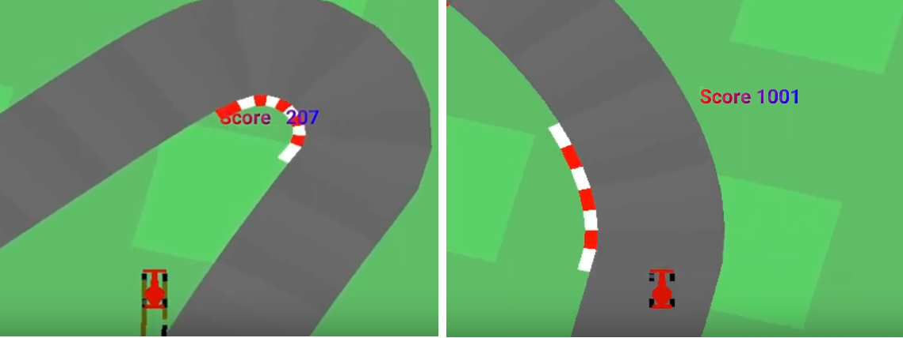
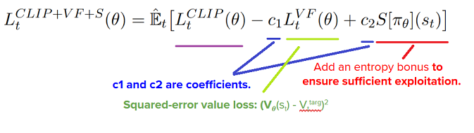
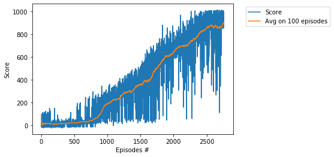

# Project - CarRacing with PPO, Learning from Raw Pixels 

### Introduction

This is the continuous control task learning from pixels, a top-down racing environment. 
State consists of 96x96 pixels. Reward is -0.1 every frame and +1000/N for every track tile visited, 
where N is the total number of tiles in track. For example, if you have finished in 732 frames, 
your reward is 1000 - 0.1\*732 = 926.8 points. The indicators shown at the bottom of the window. 
CarRacing-v0 defines "solving" as getting average reward of 900 over 100 consecutive trials.

### Requirement

* [pytorch 0.41](https://pytorch.org/)
* [gym 0.10](https://github.com/openai/gym)

### Environment
The environment is simulated by OpenAI package __gym__ as follows:

      env = gym.make('CarRacing-v0', verbose=0)
      
### Hyperparameters

Agent uses the following hyperparameters:   

_GAMMA=0.99_ # discount, the coefficient related to the _next state_    
_EPOCH= 8_ # the parameter in the update mexanism of the PPO  (beter than 10)   
_MAX_SIZE = 2000_ # the maximal size of the buffer used in the update mechanism   
_BATCH=128_  # optimizer and backward mechisms work after sampling BATCH elements   
_LEARNING_RATE = 0.001_   
_EPS=0.1_ # the clipping parameter using for calculation of the _action loss_    

     surr1 = ratio * advantage
     surr2 = torch.clamp(ratio, 1.0 - EPS, 1.0 + EPS) * advantage
     action_loss = -torch.min(surr1, surr2)

### Neural Network

We use the CNN model with 6 levels Conv2d (torch.nn.Conv2d) and 6 ectified linear units ReLU (torch.nn.ReLU).
The rewards, target and advatage values are calculated by the model:

     target = r + GAMMA * net(next_state)
     advantage = target - net(state)[[1]  ## 1-st return parameter of the forward function
     
### Beta Distribution

The CNN model is used for calculation of parameters __alpha__ and __beta__ of the Beta distribuion.    
The Beta distribution (torch.distributions.beta) is used to fetch the action samples.

     alpha, beta = net(state[index])[0]  ## 0-th return parameter of the forward function
     dist = Beta(alpha, beta)

#### References
Modeling policies as beta distributions was supposed in

"_Improving Stochastic Policy Gradients in Continuous Control with Deep Reinforcement Learning using the Beta Distribution_"
by Po-Wei Chou, Daniel Maturana, Sebastian Scherer, in Proceedings of the 34th International Conference on Machine Learning, PMLR 70:834-843, 2017., http://proceedings.mlr.press/v70/chou17a.html

See also "_Clipped Action Policy Gradient_" by Yasuhiro Fujita, Shin-ichi Maeda, https://arxiv.org/abs/1802.07564

### Update mechanism

Standard policy gradient methods perform one gradient update per data sample.     
In the [original paper](https://arxiv.org/abs/1707.06347) it was proposed a novel objective function that enables **multiple epochs**.   
This is  the **loss** function $L_{t}(\theta)$, which is (approximately) maximized each iteration:    

Parameters **c1**, **c2** and **epoch** are essential hyperparameters in the PPO algorithm.

 
### Training the Agent

We train the agent to understand that it can use information from its surroundings to inform the next best action.
The score **901.81** was achieved in the episode **2760** after training **6 hours 53 minutes**.   

